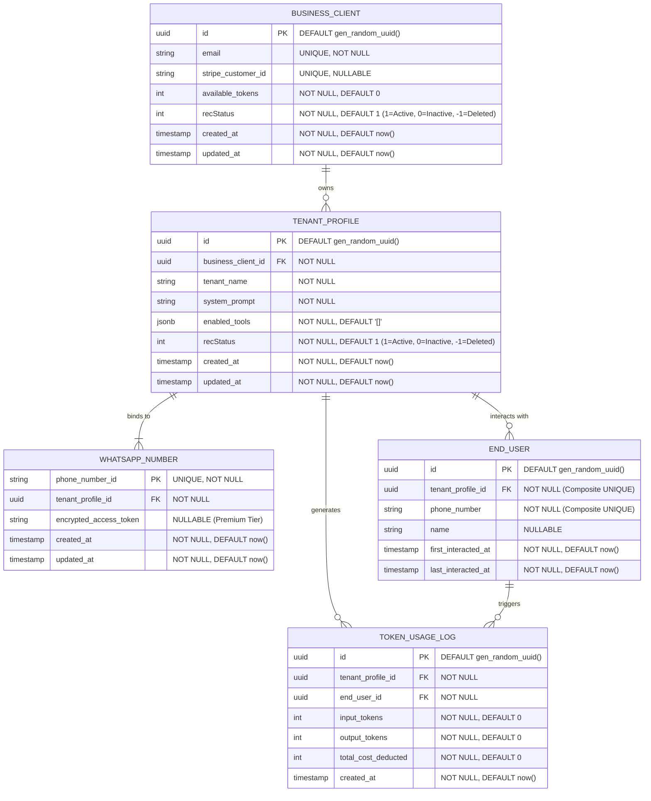

# Database Schema & State Design

*Generated for Stage 2 of the Vibe Coding Lifecycle.*

## Entity-Relationship Diagram (ERD)

## State & Caching Dependencies

1. **Routing Cache:** The mapping between `WHATSAPP_NUMBER` and `TENANT_PROFILE` changes rarely. To avoid a database hit on every single incoming webhook to determine if it's DealMate or TourGuardian, this mapping should be cached in an in-memory Map (`src/router/tenant-routing-engine.ts`) and refreshed only when a client updates their phone number.
2. **Session Memory:** OpenClaw intrinsically handles AI conversation memory. We will pass a unique, composite string (`${phone_number_id}_${end_user_phone_number}`) as the `sessionId` into the OpenClaw agent instance so that memory is strictly isolated between both different end-users *and* different agent tenants.
